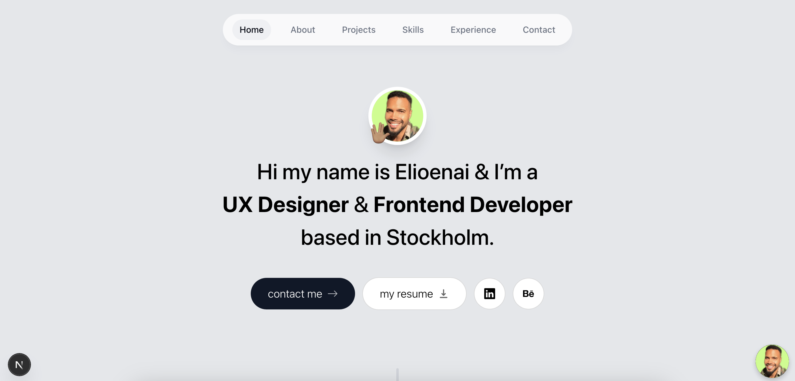

# Elioenai's Portfolio

A modern portfolio showcasing my UX design and frontend development expertise, built with Next.js and TypeScript.

### ✨ Features

- **Single-Page Navigation** (Smooth scrolling to sections)
- **Interactive Project Gallery** with technology tags
- **Professional Timeline** of work experience
- **AI Chatbot** trained on my CV (Powered by Chatbase)
- **Responsive Contact Form** with email integration

### 🛠️ Tech Stack

- 
- 
- 
- 

### 💼 Key Dependencies

- {
- "@react-email/components": "Email templates",
- "framer-motion": "Animations",
- "react-intersection-observer": "Scroll effects",
- "react-vertical-timeline-component": "Experience timeline",
- "resend": "Email delivery"
- }

### 🧭 Navigation System

### 🚧 Future Roadmap

- Immediate Priorities
- Feature Status Details
- Dark Mode Planned localStorage + system pref
- Service Checklist Designed Checkbox selector for:
- UX Design
- Frontend Dev
- Consulting
  **Availability Badge**
  **Real-time status indicator**

### 📦 Setup & Deployment

# 1. Clone repo

git clone https://github.com/Zuekiin/portfolio_project.git

# 2. Install dependencies

npm install

# 3. Run locally

npm run dev
